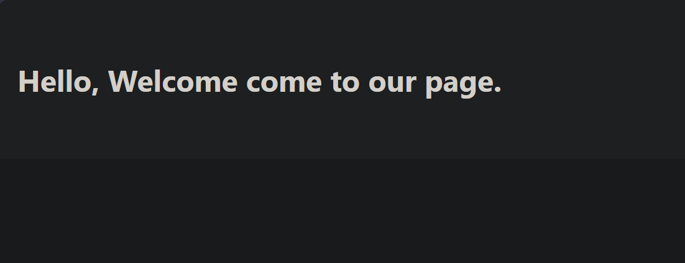
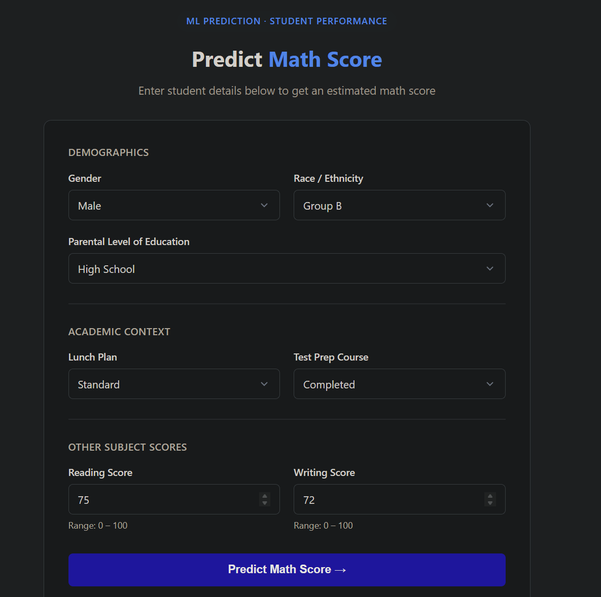

## End to End Machine Learning Project

# 🎓 Student Performance Prediction (ML Web App)

A machine learning web application that predicts student performance based on demographic and academic inputs. The project is deployed using **Flask, Docker, and Render**, demonstrating an end-to-end ML deployment pipeline.

---

## 🚀 Live Demo

👉 https://student-performance-prediction-yc2o.onrender.com/predict

---

## 🖥️ Application Preview

### 🏠 Home Page



### 📊 Prediction Form



### 🎯 Prediction Result


---

## 📌 Project Overview

This project predicts a student's performance score based on features such as:

- Gender
- Race/Ethnicity
- Parental level of education
- Lunch type
- Test preparation course
- Reading score
- Writing score

The model is trained using regression algorithms and deployed as a web application for real-time predictions.

---

## 🧠 Machine Learning Pipeline

```
User Input (Web Form)
        ↓
Flask Backend (CustomData)
        ↓
Data Preprocessing (Pipeline)
        ↓
Trained ML Model
        ↓
Prediction Output
```

---

## 🛠️ Tech Stack

### 🔹 Backend

- Python
- Flask
- Gunicorn

### 🔹 Machine Learning

- Pandas
- NumPy
- Scikit-learn
- XGBoost
- CatBoost
- Dill (model serialization)

### 🔹 Deployment

- Docker
- Render

---

## 📁 Project Structure

```
├── .github/workflows/         # CI/CD pipelines (render.yaml)
├── artifacts/                 # Serialized models and preprocessors (model.pkl, preprocessor.pkl)
├── logs/                      # Execution logs generated by logger.py
├── notebook/                  # Jupyter notebooks for EDA and model experimentation
│   ├── data/
│   ├── MODEL TRAINER.ipynb
│   └── Student-Performance-EDA.ipynb
├── src/                       # Core package source code
│   ├── components/            # Pipeline stages (Data Ingestion, Transformation, Model Trainer)
│   ├── config/                # Path configurations
│   ├── pipeline/              # Training and prediction pipelines
│   ├── exception.py           # Custom exception handling
│   ├── logger.py              # Custom logging module
│   └── utils.py               # Helper functions and model evaluation metrics
├── static/                    # CSS stylesheets
├── templates/                 # HTML templates (index.html, action.html, layout.html)
├── app.py                     # Flask application entry point
├── Dockerfile                 # Docker image configuration
├── requirements.txt           # Project dependencies
└── setup.py                   # Package configuration for local module imports
```

---

## ⚙️ How to Run Locally

### 1. Clone the repository

```bash
git clone https://github.com/your-username/student-performance-prediction.git
cd student-performance-prediction
```

### 2. Create virtual environment

```bash
python -m venv venv
source venv/bin/activate   # Linux/Mac
venv\Scripts\activate      # Windows
```

### 3. Install dependencies

```bash
pip install -r requirements.txt
```

### 4. Run application

```bash
python app.py
```

App will run at:

```
http://127.0.0.1:5000
```

---

## 🐳 Run using Docker

### Build image

```bash
docker build -t student-performance-app .
```

### Run container

```bash
docker run -p 5000:5000 student-performance-app
```

---

## 🌐 Deployment

The project is deployed using **Render** with Docker support.

- Automatic deployment from GitHub
- Containerized using Docker
- Production server: Gunicorn

---

## 📊 Model Performance

- Regression-based ML model
- Trained on student performance dataset
- Optimized preprocessing pipeline for categorical + numerical features

---

## Key Features

- End-to-end ML pipeline
- Real-time prediction via web UI
- Dockerized application
- Cloud deployment (Render)
- Modular code structure

---

## 📌 Future Improvements

- Add model explainability (SHAP)
- Switch to FastAPI for higher performance
- Add CI/CD pipeline (GitHub Actions)
- Add database logging for predictions
- Improve UI using Bootstrap

---

## Author

**Saidur Ahrar Sristi**


